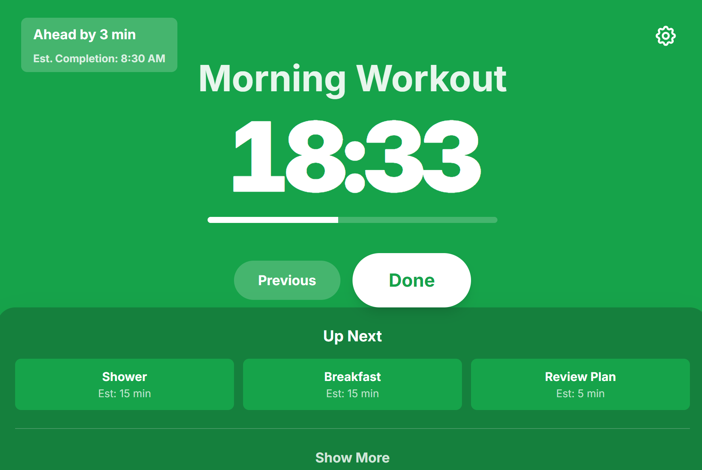
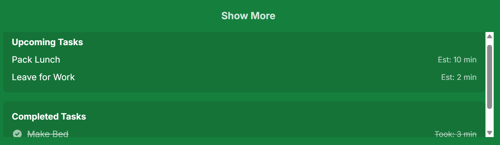

## Routine Timer

A Flutter app to plan and execute a focused morning routine. Configure tasks the night before, then get a clean, glanceable countdown experience the next morning. Built with Flutter, BLoC, and a modern Material 3 theme.

### Highlights
- **Task queue management**: Add, edit, reorder tasks with estimated durations
- **Pre-start countdown**: Black screen countdown until your configured start time
- **Execution UI**: Large timer, progress bar, previous/done actions
- **Schedule tracking**: Ahead/behind indicator and estimated completion time
- **Breaks between tasks**: Global defaults plus per-gap toggles
- **BLoC state management**: Clear separation of UI and business logic
- **Ready for persistence**: Firebase dependencies included (integration planned)

### Screens (mockups)



---

## Getting Started

### Prerequisites
- **Flutter**: Stable channel (Dart ≥ 3.9). Check with:
  ```bash
  flutter --version
  ```
- **Android/iOS tooling** for device/emulator testing (Android Studio / Xcode)
- Optional (for BLoC DevTools): **Node.js** to run a Remote DevTools server

### Install dependencies
```bash
flutter pub get
```

### Run on a device or simulator
1) List devices:
```bash
flutter devices
```
2) Run the app (replace <deviceId>):
```bash
flutter run -d <deviceId> --target=lib/main.dart
```
- Web (optional):
```bash
flutter run -d chrome --target=lib/main.dart
```

### Run tests
```bash
flutter test
```
Tests live under `test/` and cover models, BLoC logic, and widgets.

### Lint and format
```bash
flutter analyze
dart format .
```

---

## Architecture

### Tech stack
- **Flutter (Material 3)** UI with a minimal, tablet-friendly design
- **BLoC** (`flutter_bloc`, `equatable`) for deterministic state transitions
- **Firebase** (`firebase_core`, `cloud_firestore`, `firebase_auth`) planned for persistence

### Code organization
- **Entry point**: `lib/main.dart`
- **Routing**: `lib/src/router/app_router.dart`
  - Routes: `/` (pre-start), `/main` (execution), `/tasks` (task management)
- **Theme**: `lib/src/app_theme.dart` (Material 3, green/red scheme)
- **State**: `lib/src/bloc/*` (events, states, `RoutineBloc`)
- **Models**: `lib/src/models/*`
- **Screens**: `lib/src/screens/*`
- **Utilities**: `lib/src/utils/*`

### State management
- `RoutineBloc` sources initial sample data on startup and handles events such as:
  - selecting tasks, reordering, toggling breaks, updating settings
  - marking tasks done and moving to the next

---

## Development Notes

### BLoC DevTools (optional)
This project integrates a `RemoteDevToolsObserver` in debug builds at `127.0.0.1:8000`. To inspect BLoC state changes:

1) Start a Remote DevTools server (Redux remotedev):
```bash
npx remotedev --hostname=127.0.0.1 --port=8000
```
2) Launch the app. If the connection fails, the app falls back to a simple observer.

### Firebase (planned)
Firebase packages are included but not yet configured. To enable persistence later:
- Add platform config files (Google Services) for Android/iOS/web
- Initialize Firebase on app startup
- Implement a repository to `loadRoutine()` and `saveRoutine()`

---

## Roadmap and Plans
- **High-level plan**: see `plan/Plan.md`
- **Feature and UX details**: see `plan/Routine Timer.md`

These documents outline the phases from core infrastructure through Firebase integration, execution UI, and polish.

---

## Project Status
Early development with placeholder screens and working navigation/theme. Core BLoC and models exist with sample data; Firebase integration and full UI interactions are planned next.

---

## Troubleshooting
- If no devices are listed, set up an emulator or plug in a device and enable USB debugging
- If `RemoteDevToolsObserver` cannot connect, ensure `npx remotedev` is running on `127.0.0.1:8000`
- For build issues, run `flutter clean && flutter pub get`

---

## License
Add your preferred license here (e.g., MIT).
